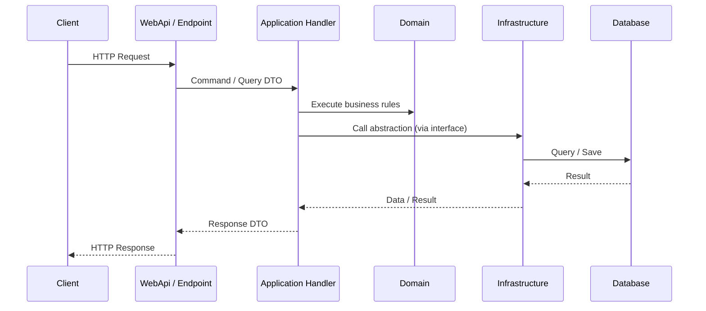
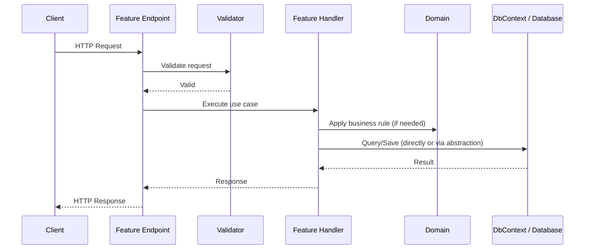

# Architecture Modern .NET API Application - Vertical Slice on Clean Architecture

> **Standard Document** — Architecture guidance for structuring .NET Web API projects using Clean Architecture boundaries with Vertical Slice use-case organization.
>
> Tài liệu này so sánh Clean Architecture / Vertical Slice và hướng dẫn cách áp dụng hybrid (CA làm biên giới, VS làm tổ chức feature) cho dự án .NET.
> Đọc khi cần chọn kiến trúc, dựng solution structure, hoặc review feature có đúng slice hay không.

---

## Table of Contents

1. [Introduction](#1-introduction)
2. [Architecture Analysis](#2-architecture-analysis)
   - [Traditional N-Layer Architecture](#21-traditional-n-layer-architecture)
   - [Clean Architecture](#22-clean-architecture)
   - [Vertical Slice Architecture](#23-vertical-slice-architecture)
3. [WHY — The Problem Each Architecture Solves](#3-why--the-problem-each-architecture-solves)
4. [WHEN — Choosing the Right Architecture](#4-when--choosing-the-right-architecture)
5. [Side-by-Side Comparison](#5-side-by-side-comparison)
6. [Decision Matrix](#6-decision-matrix)
7. [The Hybrid Approach — Vertical Slice in Clean Architecture](#7-the-hybrid-approach--vertical-slice-in-clean-architecture)
8. [Applying Vertical Slices to Each Module/Feature](#8-applying-vertical-slices-to-each-modulefeature)
9. [Recommended Solution Structures](#9-recommended-solution-structures)
10. [Worked Example — `UpdateSettingValue` API](#10-worked-example--updatesettingvalue-api)
11. [Design Checklists](#11-design-checklists)
12. [Conclusion](#12-conclusion)
13. [References](#13-references)

---

## 1. Introduction

Modern .NET Web API development demands an architecture that balances **domain protection** with **development velocity**. Two dominant architectural styles have emerged in the .NET ecosystem:

- **Clean Architecture** — focuses on protecting business logic from framework and infrastructure dependencies by enforcing strict dependency rules between concentric layers.
- **Vertical Slice Architecture (VSA)** — focuses on maximizing feature cohesion by organizing code around individual use cases rather than technical layers.

Neither is universally superior. This document analyzes both architectures, explains **WHY** each exists and **WHEN** to use each, provides a **Decision Matrix**, and then presents the recommended approach:

> **Apply Vertical Slice organization to each small module/feature *inside* a Clean Architecture application.**

---

## 2. Architecture Analysis

### 2.1. Traditional N-Layer Architecture

The traditional N-Layer (or N-Tier) architecture organizes code into horizontal technical layers:

```text
┌─────────────────────────────────┐
│   Presentation / UI Layer       │  ← Controllers, Views, APIs
├─────────────────────────────────┤
│   Business Logic Layer (BLL)    │  ← Services, Rules
├─────────────────────────────────┤
│   Data Access Layer (DAL)       │  ← Repositories, ORM, SQL
└─────────────────────────────────┘
```

**How it works:** The UI calls the BLL, and the BLL calls the DAL. Dependencies flow top-to-bottom.

**Key problem:** The BLL has a **compile-time dependency on the DAL**. This makes business logic hard to test in isolation and expensive to change when switching databases or infrastructure. Microsoft identifies this as a fundamental limitation and recommends Dependency Inversion to address it. ([Microsoft Learn][1])

| Strengths | Weaknesses |
|-----------|------------|
| Simple mental model | BLL depends on DAL (hard to test) |
| Well-understood by most developers | Changing infrastructure impacts business logic |
| Clear separation of technical concerns | Features are scattered across all layers |
| Good for small/simple applications | Leads to "spaghetti code" as complexity grows |

---

### 2.2. Clean Architecture

#### 2.2.1. Core Principle

Clean Architecture (also known as Onion Architecture, Hexagonal Architecture, or Ports-and-Adapters) answers one fundamental question:

> **How do we prevent business/domain logic from depending on databases, ORMs, frameworks, UI, or external services?**

The answer is the **Dependency Rule**:

> Dependencies must always point **inward**, toward the Domain and Application Core. The inner layers must never know about the outer layers.

```text
Presentation/API  ───►  Application  ───►  Domain
Infrastructure    ───►  Application/Domain
```

The Domain knows nothing about:

```text
ASP.NET Core, Entity Framework Core, SQL Server/PostgreSQL,
Redis, RabbitMQ/Kafka, Email providers, File storage, External APIs
```

Microsoft describes Application Core as the center containing the business model, entities, services, and interfaces. Infrastructure contains EF `DbContext`, migrations, and data access implementations. The UI/Web project is the entry point that interacts with infrastructure through abstractions defined in Application Core. ([Microsoft Learn][1])

#### Clean Architecture and CQRS

In practice, Clean Architecture in .NET almost always goes hand-in-hand with **CQRS (Command Query Responsibility Segregation)**. CQRS separates the write side (Commands — create, update, delete) from the read side (Queries — fetch, search, list), each handled by a dedicated handler class. This pairing is natural because:

- **Single Responsibility:** Each handler orchestrates exactly one use case, keeping Application layer classes focused and small.
- **Optimized data access:** Write handlers can go through the full Domain model and repository abstractions to enforce invariants, while read handlers can bypass the Domain entirely and query the database directly (via EF Core projections, Dapper, or raw SQL) for performance.
- **Pipeline behaviors:** Libraries like MediatR allow cross-cutting concerns (validation, authorization, logging, transaction management) to be applied uniformly to all commands and queries via pipeline behaviors, without polluting individual handlers.
- **Foundation for Vertical Slices:** Because each command or query is already a self-contained unit with its own request DTO, handler, validator, and response DTO, the Application layer naturally organizes into feature folders — one folder per use case — which is exactly the Vertical Slice pattern.

Most popular .NET Clean Architecture templates (Jason Taylor's, Ardalis's, Milan Jovanović's) ship with MediatR or a similar mediator and structure their Application layer around `Commands/` and `Queries/` grouped by feature. This is why the hybrid approach described later in this document feels like a natural evolution rather than a departure from Clean Architecture. ([Jason Taylor][3], [MediatR GitHub][4])

#### 2.2.2. Typical .NET Solution Structure

```text
src/
  MyApp.Domain/
    Entities/
    ValueObjects/
    Enums/
    Events/
    Exceptions/
    Rules/

  MyApp.Application/
    Abstractions/
    DTOs/
    UseCases/
    Behaviors/
    Interfaces/
    Validators/

  MyApp.Infrastructure/
    Persistence/
      AppDbContext.cs
      Configurations/
      Migrations/
    Repositories/
    Services/
    Identity/
    Caching/
    Messaging/

  MyApp.WebApi/
    Controllers/
    Endpoints/
    Middlewares/
    Filters/
    Program.cs

tests/
  MyApp.Domain.Tests/
  MyApp.Application.Tests/
  MyApp.Infrastructure.Tests/
  MyApp.WebApi.Tests/
```

#### 2.2.3. Layer Responsibilities

| Layer | Responsibility | Contains | Must NOT Contain |
|-------|---------------|----------|-----------------|
| **Domain** | Core business rules, invariants | Entity, Value Object, Aggregate, Domain Event, Domain Exception | EF Core, ASP.NET, API DTOs, repository implementations |
| **Application** | Use case orchestration | Command, Query, Handler, Interface, Validator, DTO, Pipeline Behavior | SQL queries, HTTP context, provider-specific SDKs |
| **Infrastructure** | Technical implementations | EF Core, Redis, Email, File Storage, Message Bus, External API Client | Core business rules |
| **Presentation/WebApi** | Accept requests, return responses | Controller, Minimal API Endpoint, Middleware, Auth filter, Swagger/OpenAPI | Complex business logic, direct data access |
| **Tests** | Verification per layer | Unit tests (Domain/Application), Integration tests (Infrastructure/API) | — |

#### 2.2.4. Typical Request Flow



**Key insight:** Application only knows interfaces like `IUnitOfWork`, `IEmailSender`, `ICurrentUser`, `IDateTimeProvider`. Real implementations live in Infrastructure and are wired via Dependency Injection at the composition root (`Program.cs`). Microsoft emphasizes that the UI project may reference Infrastructure for DI configuration, but actual usage should be limited to the composition root. ([Microsoft Learn][1])

#### 2.2.5. Code Example — Use Case Handler

```csharp
public sealed record CreateUserCommand(
    string Email,
    string FullName
) : IRequest<Guid>;

public sealed class CreateUserCommandHandler
    : IRequestHandler<CreateUserCommand, Guid>
{
    private readonly IUserRepository _userRepository;
    private readonly IUnitOfWork _unitOfWork;

    public CreateUserCommandHandler(
        IUserRepository userRepository,
        IUnitOfWork unitOfWork)
    {
        _userRepository = userRepository;
        _unitOfWork = unitOfWork;
    }

    public async Task<Guid> Handle(
        CreateUserCommand request,
        CancellationToken cancellationToken)
    {
        var user = User.Create(request.Email, request.FullName);

        await _userRepository.AddAsync(user, cancellationToken);
        await _unitOfWork.SaveChangesAsync(cancellationToken);

        return user.Id;
    }
}
```

#### 2.2.6. Strengths

| Strength | Analysis |
|----------|----------|
| **Domain protection** | Domain has zero dependencies on EF Core, ASP.NET, databases, or external APIs |
| **Testability** | Application Core can be unit-tested independently. Microsoft confirms Clean Architecture enables testing Application Core in isolation and swapping implementations easily. ([Microsoft Learn][1]) |
| **Long-term maintainability** | Swapping DB, message broker, email provider, or UI has minimal impact on Domain/Application |
| **Clear responsibility boundaries** | Developers know exactly which layer a class belongs to |
| **DDD-compatible** | Aggregates, Entities, Value Objects, Domain Events have a natural home |
| **Enterprise governance** | Easy to enforce dependency rules, coding conventions, and architecture tests |

#### 2.2.7. Weaknesses

| Weakness | Analysis |
|----------|----------|
| **Boilerplate overhead** | A single small feature may require changes to Controller, DTO, Command, Handler, Validator, Repository, Mapping |
| **Risk of over-engineering** | Simple CRUD can generate excessive abstractions like `IRepository<T>`, `IService<T>`, `IManager<T>` |
| **Difficult navigation** | Code is split by layer — understanding one feature requires opening multiple projects/folders |
| **Potentially redundant Repository pattern** | With EF Core, mechanical generic repositories can obscure EF's powerful query capabilities |
| **Risk of anemic domain** | If all logic lives in Application Handlers, the Domain becomes a bag of property getters/setters |

---

### 2.3. Vertical Slice Architecture

#### 2.3.1. Core Principle

Vertical Slice Architecture (VSA) organizes code by **feature/use case/request** rather than by technical layer.

Instead of:

```text
Controllers/    Services/    Repositories/    Validators/    DTOs/
```

VSA organizes as:

```text
Features/
  Users/
    CreateUser/
    GetUserById/
    UpdateUser/
  Orders/
    CreateOrder/
    CancelOrder/
    GetOrderHistory/
```

The core philosophy:

> **Minimize coupling between slices, maximize coupling inside a slice.**

All files related to a single use case live together; different use cases should have minimal dependencies on each other. Jimmy Bogard describes VSA as building around each request, gathering all concerns from front-end to back-end, and reducing unnecessary shared abstractions like generic services, repositories, or controllers. ([Jimmy Bogard][2])

#### 2.3.2. Typical .NET Solution Structure

```text
src/
  MyApp.Api/
    Features/
      Users/
        CreateUser/
          Endpoint.cs
          Request.cs
          Response.cs
          Validator.cs
          Handler.cs
        GetUserById/
          Endpoint.cs
          Request.cs
          Response.cs
          Handler.cs
      Orders/
        CreateOrder/
          Endpoint.cs
          Request.cs
          Response.cs
          Validator.cs
          Handler.cs
        CancelOrder/
          Endpoint.cs
          Request.cs
          Handler.cs

    Common/
      Behaviors/
      Errors/
      Auth/
      Extensions/

    Infrastructure/
      AppDbContext.cs
      Services/
```

#### 2.3.3. Common .NET Tools with VSA

| Tool / Pattern | Purpose |
|---------------|---------|
| **Minimal APIs** | Lightweight endpoints per feature |
| **MediatR / Mediator** | Dispatch commands/queries to handlers |
| **FastEndpoints / Carter** | Organize endpoints by module |
| **FluentValidation** | Per-request validators |
| **EF Core directly in handlers** | Reduce abstraction for simple use cases |
| **Dapper / raw SQL for queries** | Optimize read models |
| **Lightweight CQRS** | Separate commands and queries per request |

MediatR is not mandatory but is popular in .NET because it supports request/response patterns, commands, queries, notifications, and events for in-process messaging. ([MediatR GitHub][4])

#### 2.3.4. Typical Request Flow



#### 2.3.5. Code Example — Slice with Direct EF Core

```csharp
public sealed record CreateUserRequest(
    string Email,
    string FullName
);

public sealed record CreateUserResponse(Guid Id);

public sealed class CreateUserHandler
{
    private readonly AppDbContext _dbContext;

    public CreateUserHandler(AppDbContext dbContext)
    {
        _dbContext = dbContext;
    }

    public async Task<CreateUserResponse> Handle(
        CreateUserRequest request,
        CancellationToken cancellationToken)
    {
        var user = User.Create(request.Email, request.FullName);

        _dbContext.Users.Add(user);
        await _dbContext.SaveChangesAsync(cancellationToken);

        return new CreateUserResponse(user.Id);
    }
}
```

A key benefit of VSA is that each slice can choose its own implementation strategy: one GET endpoint might use EF Core, while another uses Dapper with raw SQL. Milan Jovanović highlights this as a major advantage — each use case is tailored to its specific requirements. ([Milan Jovanović][5])

#### 2.3.6. Strengths

| Strength | Analysis |
|----------|----------|
| **High feature cohesion** | All code for a use case lives in one folder |
| **Easy to add new features** | Usually just adding a new folder/slice, rarely modifying shared services |
| **Reduced side effects** | Less shared code modification means lower risk of breaking other features. Bogard emphasizes "new features only add code." ([Jimmy Bogard][2]) |
| **Fewer unnecessary abstractions** | No mandatory Controller → Service → Repository chain for every request |
| **Natural CQRS fit** | HTTP GET maps naturally to Query; POST/PUT/DELETE maps to Command |
| **Feature-team ownership** | Each squad can own a group of slices |
| **Faster delivery** | Less ceremony than traditional Clean Architecture |

#### 2.3.7. Weaknesses

| Weakness | Analysis |
|----------|----------|
| **Logic duplication risk** | Without discipline, similar validation/business rules get duplicated across slices |
| **Blurred domain boundaries** | Developers may stuff all logic into handlers, weakening the domain model |
| **Inconsistent architecture** | Each slice choosing its own approach can create an inconsistent codebase |
| **Cross-cutting concerns need good design** | Logging, validation, transaction, authorization, caching need explicit pipeline/filter/middleware |
| **Not automatic for complex domains** | With many invariants, aggregates, and workflows, transaction scripts in handlers become unmanageable |
| **Many small files** | A system with many endpoints produces many folders/slices |

---

## 3. WHY — The Problem Each Architecture Solves

Each architecture exists because it answers a specific, real-world pain point:

### 3.1. Why Clean Architecture?

**Problem:** In traditional layered applications, business logic depends on infrastructure. Changing the database, ORM, or framework requires modifying business rules. Testing business logic requires a running database.

**Solution:** Clean Architecture **inverts dependencies** so that infrastructure depends on abstractions defined in the Application Core. The Domain never knows about SQL Server, Redis, or ASP.NET.

> **Clean Architecture answers:** *"How do we protect our core business logic from framework, database, UI, and external system changes?"*

**Use Clean Architecture when you need:**

- A domain with complex business rules, invariants, and aggregates
- Protection from anticipated infrastructure changes (DB migrations, cloud transitions)
- Strict testability — unit tests for business logic without database dependencies
- Compliance, audit, and security boundaries
- Long-lived enterprise systems maintained by multiple teams over years
- DDD tactical patterns (Aggregates, Value Objects, Domain Events)

**Examples:** Banking, insurance, document workflow, e-commerce order lifecycle, ERP, HRM/payroll, healthcare, booking systems with complex constraints.

### 3.2. Why Vertical Slice Architecture?

**Problem:** In layered architectures, implementing a single feature requires touching multiple layers — Controller, Service, Repository, DTO, Validator, Mapper — scattered across different projects and folders. Adding a feature means modifying shared code and risking side effects.

**Solution:** VSA groups **all code for a single use case into one folder**. New features are additive. Coupling between features is minimized.

> **Vertical Slice Architecture answers:** *"How do we develop each feature quickly, make it easy to navigate, and minimize the risk of breaking other features?"*

**Use VSA when you need:**

- Feature-based development where each use case maps to a clear API endpoint / command / query
- CRUD-heavy or API-heavy systems with many endpoints
- Fast delivery with minimal ceremony
- Feature-team ownership and parallel development
- Microservice or small Modular Monolith scope where full Clean Architecture is overhead

**Examples:** Settings management APIs, document search, user profile CRUD, dashboard data endpoints, simple reporting.

### 3.3. Why the Hybrid?

**Problem:** Pure Clean Architecture is too ceremonial for simple features. Pure VSA doesn't protect domain invariants in complex systems. Teams want both speed and safety.

**Solution:** Use Clean Architecture to **define dependency boundaries** (Domain, Application, Infrastructure, Presentation) and use Vertical Slice to **organize features inside the Application layer**.

> **The Hybrid answers:** *"How do we get Clean Architecture's protection AND Vertical Slice's development speed?"*

---

## 4. WHEN — Choosing the Right Architecture

### 4.1. When to Use Clean Architecture

| Scenario | Reason |
|----------|--------|
| Complex business domain (banking, insurance, workflow) | Many rules, invariants, and domain events need a protected Domain layer |
| Anticipated infrastructure changes | Switching from SQL Server → PostgreSQL, on-prem → cloud, REST → gRPC |
| Long-lived enterprise system | Multiple years of maintenance, multiple teams, many integrations |
| Rigorous testing requirements | Business rules must be testable without a real database |
| Compliance/audit/security requirements | Financial systems, government systems, medical records |
| DDD tactical patterns needed | Aggregates, Entities, Value Objects, Domain Events |

### 4.2. When to Use Vertical Slice Architecture

| Scenario | Reason |
|----------|--------|
| Feature-based development (each feature = one API) | Natural 1:1 mapping between use case and slice |
| CRUD/API-heavy system | Many endpoints with straightforward logic |
| Fast delivery / rapid prototyping | Less boilerplate, quicker iterations |
| Feature-team organization (squads) | Each team owns a set of slices with clear boundaries |
| Small microservices | Full Clean Architecture layers are excessive overhead |

### 4.3. When NOT to Use Each

#### Do NOT use full Clean Architecture when

| Scenario | Reason |
|----------|--------|
| Small app, simple CRUD | Too many projects, classes, and abstractions |
| Prototype / MVP under time pressure | Boilerplate slows delivery |
| Team unfamiliar with DDD/layering | Degenerates into mechanical "Controller → Service → Repository" |
| Domain has almost no business rules | A complex Domain layer adds no value |

#### Do NOT use pure Vertical Slice when

| Scenario | Reason |
|----------|--------|
| Complex domain with many invariants | Logic gets buried in handlers; consistency is hard to enforce |
| Many shared rules across features | High duplication risk |
| Team lacks conventions/discipline | Each slice ends up with a different style |
| Strong dependency boundaries required | Pure VSA can be too flexible |
| System needs many infrastructure adapters | Without Application/Domain separation, business logic leaks into the API layer |

---

## 5. Side-by-Side Comparison

| Criterion | Clean Architecture | Vertical Slice Architecture |
|-----------|-------------------|----------------------------|
| **Organization axis** | Technical layers (Domain → Application → Infrastructure → Presentation) | Features / use cases / requests |
| **Primary goal** | Protect business logic from infrastructure | Optimize delivery speed and feature cohesion |
| **Dependency rule** | Strict: dependencies always point inward | Flexible: dependencies isolated between slices |
| **Changing a feature** | May require changes across multiple layers/projects | Usually confined to one folder/slice |
| **Domain complexity** | Excellent for complex domains and DDD | Suited for simple-to-medium domains; complex domains need explicit Domain separation |
| **Simple CRUD** | Tends to be heavyweight | Naturally suited |
| **Complex queries / read models** | Through Application + Repository/Query Service | Directly via EF/Dapper inside the query slice |
| **Testing** | Excellent unit testing of Domain/Application | Excellent feature/use-case integration tests with less mocking |
| **Boilerplate** | Higher | Lower (when done correctly) |
| **Codebase consistency** | Higher — enforced by layer rules | Depends on team conventions |
| **Developer onboarding** | Easier for those familiar with enterprise/layered architectures | Easier to understand by business feature, but requires discipline |
| **Infrastructure swappability** | Excellent — clear abstractions | Depends on how slices couple to infrastructure |
| **Team scalability** | Good when teams split by layer or large module | Good when teams split by feature/domain area |
| **Primary risk** | Over-engineering, excessive abstraction | Duplication, scattered logic, weak domain boundaries |

---

## 6. Decision Matrix

Use the following matrix to guide your architectural choice. For each question, if your answer is **"Yes"**, lean toward the indicated approach.

| Question | If Yes → Lean Toward |
|----------|---------------------|
| Does the domain have many critical rules and invariants? | **Clean / Hybrid** |
| Is the system long-lived with multiple teams maintaining it? | **Clean / Hybrid** |
| Is the system primarily CRUD with few business rules? | **Vertical Slice** |
| Does each feature map clearly to a command or query? | **Vertical Slice** |
| Do you anticipate switching databases or infrastructure providers? | **Clean** |
| Do you need fast delivery with minimal ceremony? | **Vertical Slice** |
| Are there many external integrations (email, message bus, storage)? | **Clean / Hybrid** |
| Is the team organized by feature/module squads? | **Vertical Slice / Hybrid** |
| Do you need DDD tactical patterns (Aggregates, Domain Events)? | **Clean / Hybrid** |
| Is this a small app or small microservice? | **Vertical Slice** or **Minimal Clean** |
| Do you want both domain protection AND fast feature delivery? | **Hybrid** ✅ |

### Scoring Guide

Count your "Yes" answers in each column:

| Clean / Hybrid "Yes" Count | Vertical Slice "Yes" Count | Recommendation |
|:---:|:---:|:---|
| ≥ 4 | ≤ 2 | **Clean Architecture** (full or Hybrid) |
| ≤ 2 | ≥ 4 | **Vertical Slice Architecture** |
| 3–5 | 3–5 | **Hybrid** — Clean boundaries + Vertical Slice features |

---

## 7. The Hybrid Approach — Vertical Slice in Clean Architecture

### 7.1. The Recommendation

For most serious .NET backend systems, the recommended approach is:

> **Clean Architecture for boundaries, Vertical Slice for use cases.**

This means:

- **Keep** the Clean Architecture project separation: Domain, Application, Infrastructure, WebApi
- **Organize** inside `Application` by feature/use case using Vertical Slice structure
- **Protect** domain rules in the Domain layer
- **Allow** each slice to choose its own implementation details (EF Core, Dapper, raw SQL)
- **Use** pipeline behaviors for cross-cutting concerns (validation, authorization, logging)

### 7.2. Hybrid Solution Structure

```text
src/
  MyApp.Domain/
    Documents/
      Document.cs
      DocumentStatus.cs
      DocumentApprovedEvent.cs
    Settings/
      SettingDefinition.cs
      SettingScope.cs

  MyApp.Application/
    Features/                          ◄── Vertical Slices live here
      Documents/
        CreateDocument/
          Command.cs
          Validator.cs
          Handler.cs
          Response.cs
        ApproveDocument/
          Command.cs
          Validator.cs
          Handler.cs
        SearchDocuments/
          Query.cs
          Handler.cs
          Response.cs
      Settings/
        UpdateSettingValue/
          Command.cs
          Validator.cs
          Handler.cs
        GetSettingDefinitions/
          Query.cs
          Handler.cs
          Response.cs

    Common/                            ◄── Shared cross-cutting concerns
      Behaviors/
        ValidationBehavior.cs
        LoggingBehavior.cs
        AuthorizationBehavior.cs
      Exceptions/
      Interfaces/

  MyApp.Infrastructure/
    Persistence/
    Caching/
    Messaging/
    Files/
    Email/

  MyApp.WebApi/
    Endpoints/
      DocumentsEndpoints.cs
      SettingsEndpoints.cs
    Program.cs
```

### 7.3. How the Hybrid Leverages Both Architectures

| Aspect | Clean Architecture Role | Vertical Slice Role |
|--------|------------------------|-------------------|
| Critical domain rules | ✅ Protected in Domain layer | Reusable across slices |
| Dependency boundaries | ✅ Enforced by project references | Does not violate boundaries |
| Feature organization | Not its primary strength | ✅ Each use case has its own folder |
| Speed of adding APIs | Moderate | ✅ Faster — one folder per feature |
| Testability | ✅ High (unit tests for Domain/Application) | ✅ High (integration tests per slice) |
| Maintainability | ✅ High (clear layer rules) | ✅ High (if team has conventions) |

### 7.4. Dependency Rules (Enforced)

```text
Domain            →  depends on nothing
Application       →  depends on Domain only
Infrastructure    →  depends on Application + Domain
WebApi            →  depends on Application (calls handlers)
                     references Infrastructure only at composition root (Program.cs)
```

---

## 8. Applying Vertical Slices to Each Module/Feature

This section demonstrates how to apply Vertical Slice organization to specific modules within a Clean Architecture application.

### 8.1. The Pattern

Every feature/use case follows this pattern inside `Application/Features/{Module}/{UseCase}/`:

**For Commands (POST/PUT/DELETE):**

```text
{Module}/
  {UseCase}/
    Command.cs           ← Request DTO (implements IRequest<TResponse>)
    Validator.cs          ← FluentValidation rules
    Handler.cs            ← Business logic orchestration
    Response.cs           ← Response DTO (optional for void commands)
```

**For Queries (GET):**

```text
{Module}/
  {UseCase}/
    Query.cs              ← Request DTO (implements IRequest<TResponse>)
    Handler.cs            ← Data retrieval logic
    Response.cs           ← Response DTO / View Model
```

### 8.2. Module: User Management

```text
Application/Features/Users/
  CreateUser/
    CreateUserCommand.cs
    CreateUserValidator.cs
    CreateUserHandler.cs
    CreateUserResponse.cs
  UpdateUserProfile/
    UpdateUserProfileCommand.cs
    UpdateUserProfileValidator.cs
    UpdateUserProfileHandler.cs
  GetUserById/
    GetUserByIdQuery.cs
    GetUserByIdHandler.cs
    GetUserByIdResponse.cs
  GetUserPermissions/
    GetUserPermissionsQuery.cs
    GetUserPermissionsHandler.cs
    GetUserPermissionsResponse.cs
  DeactivateUser/
    DeactivateUserCommand.cs
    DeactivateUserHandler.cs
```

**Domain counterpart:**

```text
Domain/Users/
  User.cs                  ← Entity with behavior (Create, Deactivate, ChangeEmail)
  UserStatus.cs            ← Value Object or Enum
  UserDeactivatedEvent.cs  ← Domain Event
  UserRules.cs             ← Business rule specifications
```

### 8.3. Module: Document Workflow

```text
Application/Features/Documents/
  CreateDocument/
    Command.cs, Validator.cs, Handler.cs, Response.cs
  SubmitForApproval/
    Command.cs, Validator.cs, Handler.cs
  ApproveDocument/
    Command.cs, Validator.cs, Handler.cs
  RejectDocument/
    Command.cs, Validator.cs, Handler.cs
  SearchDocuments/
    Query.cs, Handler.cs, Response.cs
  GetDocumentById/
    Query.cs, Handler.cs, Response.cs
  ExportDocuments/
    Query.cs, Handler.cs, Response.cs
```

**Domain counterpart:**

```text
Domain/Documents/
  Document.cs                ← Aggregate Root (with state machine logic)
  DocumentStatus.cs          ← Value Object (Draft → Submitted → Approved/Rejected)
  ApprovalStep.cs            ← Entity
  DocumentSubmittedEvent.cs  ← Domain Event
  DocumentApprovedEvent.cs   ← Domain Event
```

### 8.4. Module: Settings

```text
Application/Features/Settings/
  UpdateSettingValue/
    Command.cs, Validator.cs, Handler.cs
  GetSettingDefinitions/
    Query.cs, Handler.cs, Response.cs
  GetSettingsByScope/
    Query.cs, Handler.cs, Response.cs
```

### 8.5. Module: Orders (E-Commerce)

```text
Application/Features/Orders/
  CreateOrder/
    Command.cs, Validator.cs, Handler.cs, Response.cs
  CancelOrder/
    Command.cs, Validator.cs, Handler.cs
  GetOrderById/
    Query.cs, Handler.cs, Response.cs
  GetOrderHistory/
    Query.cs, Handler.cs, Response.cs
  CalculateOrderTotal/
    Query.cs, Handler.cs, Response.cs
```

### 8.6. Handling Shared Logic

When multiple slices share the same business rule:

| Shared Logic Type | Where to Place It | Example |
|-------------------|-------------------|---------|
| Core business invariants | **Domain** (Entity/Aggregate methods) | `Document.Submit()`, `Order.Cancel()`, `User.Deactivate()` |
| Reusable specifications/rules | **Domain** (Specification pattern) | `ActiveUserSpecification`, `EligibleForApprovalRule` |
| Cross-cutting pipeline concerns | **Application/Common/Behaviors** | `ValidationBehavior<TRequest, TResponse>`, `LoggingBehavior` |
| Shared DTOs/mappings | **Application/Common** | `PaginatedList<T>`, `AuditableResponse` |
| Infrastructure services | **Infrastructure** (implements Application interfaces) | `IEmailSender`, `IFileStorage`, `ICacheService` |

**Rule of thumb:** Don't create shared services prematurely. Only extract shared logic when you observe genuine duplication across 3+ slices.

---

## 9. Recommended Solution Structures

### 9.1. Medium-to-Large Enterprise System

```text
MyCompany.MyProduct.sln

src/
  MyProduct.Domain/
    Common/
    Aggregates/
    ValueObjects/
    Events/
    Exceptions/

  MyProduct.Application/
    Common/
      Abstractions/
      Behaviors/
        ValidationBehavior.cs
        LoggingBehavior.cs
        AuthorizationBehavior.cs
        PerformanceBehavior.cs
      Exceptions/
      Security/
      Pagination/
    Features/
      ModuleA/
        UseCase1/
        UseCase2/
      ModuleB/
        UseCase1/
        UseCase2/

  MyProduct.Infrastructure/
    Persistence/
    Identity/
    Caching/
    Messaging/
    Storage/
    ExternalServices/

  MyProduct.Api/
    Endpoints/
    Middlewares/
    Filters/
    OpenApi/
    Program.cs

tests/
  MyProduct.Domain.UnitTests/
  MyProduct.Application.UnitTests/
  MyProduct.Infrastructure.IntegrationTests/
  MyProduct.Api.FunctionalTests/
```

### 9.2. Small Microservice

```text
src/
  Service.Api/
    Features/
      Orders/
        CreateOrder/
        CancelOrder/
        GetOrderById/
      Payments/
        CreatePayment/
        ConfirmPayment/

    Domain/
    Infrastructure/
    Common/
    Program.cs
```

For small microservices, a single project with namespace/folder boundaries is sufficient. Avoid splitting into multiple projects when the overhead isn't justified.

### 9.3. Small App / MVP

```text
Api/
  Features/
  Domain/
  Infrastructure/
```

Start simple. Don't over-split from day one. Let the architecture evolve as complexity demands.

---

## 10. Worked Example — `UpdateSettingValue` API

### 10.1. Traditional Clean Architecture Approach

Files created or modified:

```text
WebApi/
  Controllers/SettingsController.cs

Application/
  Settings/
    Commands/
      UpdateSettingValueCommand.cs
      UpdateSettingValueCommandHandler.cs
      UpdateSettingValueCommandValidator.cs
  Interfaces/
    ISettingRepository.cs

Domain/
  Settings/
    SettingDefinition.cs
    SettingValue.cs

Infrastructure/
  Persistence/
    Repositories/
      SettingRepository.cs
    Configurations/
      SettingValueConfiguration.cs
```

✅ **Pros:** Clear dependencies, excellent testability.  
❌ **Cons:** Files scattered across 4 projects and 6+ folders.

### 10.2. Pure Vertical Slice Approach

```text
Features/
  Settings/
    UpdateSettingValue/
      Endpoint.cs
      Request.cs
      Response.cs
      Validator.cs
      Handler.cs
```

✅ **Pros:** All code for the API in one folder. Easy to find and navigate.  
❌ **Cons:** If multiple slices share setting rules, logic must be extracted to Domain or a Common service.

### 10.3. Hybrid Approach (Recommended)

```text
Application/
  Features/
    Settings/
      UpdateSettingValue/
        Command.cs         ← IRequest<Unit>
        Validator.cs        ← FluentValidation rules
        Handler.cs          ← Orchestrates domain + persistence
        Response.cs         ← (optional)

Domain/
  Settings/
    SettingDefinition.cs    ← Business rules live here
    SettingScope.cs
    SettingValue.cs

Infrastructure/
  Persistence/
    AppDbContext.cs          ← EF Core context

WebApi/
  Endpoints/
    SettingsEndpoints.cs     ← Minimal API endpoint
```

✅ **This is the most balanced approach for .NET enterprise systems.**

---

## 11. Design Checklists

### 11.1. Clean Architecture Checklist

```text
[ ] Domain does NOT reference EF Core, ASP.NET Core, or Infrastructure
[ ] Application does NOT call infrastructure implementations directly
[ ] Infrastructure implements interfaces defined in Application
[ ] WebApi does NOT contain complex business logic
[ ] Critical business rules reside in Domain (entities, value objects, aggregates)
[ ] Use case orchestration resides in Application (handlers)
[ ] Cross-cutting concerns handled via pipeline behaviors / middleware / filters
[ ] Domain/Application tests run without a real database
```

### 11.2. Vertical Slice Checklist

```text
[ ] Each use case has its own folder
[ ] Request / Response / Validator / Handler are co-located
[ ] Shared services are NOT created prematurely
[ ] Truly shared logic is extracted to Domain or Common only when duplication is real
[ ] Query slices can be optimized independently (EF Core, Dapper, raw SQL)
[ ] Command slices ensure transaction consistency
[ ] Authorization / Validation / Logging use pipeline behaviors or filters
[ ] No handler is excessively large (refactor to Domain if growing)
```

### 11.3. Hybrid Checklist

```text
[ ] Solution has 4 projects: Domain, Application, Infrastructure, WebApi (+ Tests)
[ ] Application/Features/ is organized by module, then by use case
[ ] Each use case folder contains Command/Query + Validator + Handler + Response
[ ] Domain contains entities with behavior, not just property bags
[ ] Infrastructure implements Application interfaces
[ ] Handlers orchestrate — they call Domain methods and Infrastructure abstractions
[ ] Pipeline behaviors handle validation, logging, authorization, performance
[ ] New features = new folder in Application/Features + new endpoint in WebApi
[ ] Dependency rule is never violated: Domain ← Application ← Infrastructure ← WebApi
```

---

## 12. Conclusion

There is no universal answer that "Clean Architecture is better" or "Vertical Slice is better." They solve different problems:

**Clean Architecture** excels at answering:

> *"How do we protect core business logic from frameworks, databases, UI, and external systems?"*

**Vertical Slice Architecture** excels at answering:

> *"How do we develop each feature quickly, make it easy to read, and minimize risk of breaking other features?"*

For modern .NET backend development — especially with Web API, CQRS, Minimal APIs, MediatR/FastEndpoints, and EF Core — the most effective approach is:

> ### **Clean Architecture + Vertical Slice Use Cases**

In practice, this means:

```text
Use Clean Architecture    → to define dependency boundaries between layers
Use Vertical Slice        → to organize commands / queries / use cases inside Application
Use Domain                → to protect critical business rules and invariants
Use Infrastructure        → to contain all technical implementations
Use Pipeline Behaviors    → to handle cross-cutting concerns (validation, logging, auth)
```

This hybrid approach gives teams the **structural guardrails** of Clean Architecture and the **development agility** of Vertical Slices — the best of both worlds.

---

## 13. References

| # | Source | Description |
|---|--------|-------------|
| 1 | [Microsoft Learn — Common Web Application Architectures][1] | Official Microsoft guidance on layered, N-tier, and Clean Architecture for ASP.NET Core |
| 2 | [Jimmy Bogard — Vertical Slice Architecture][2] | The original blog post defining VSA, emphasizing feature cohesion over layer cohesion |
| 3 | [Jason Taylor — Clean Architecture Solution Template][3] | Popular .NET template demonstrating Clean Architecture with feature-organized use cases |
| 4 | [MediatR — GitHub][4] | In-process messaging library for request/response, commands, queries, notifications |
| 5 | [Milan Jovanović — Vertical Slice Architecture][5] | Practical guide to implementing VSA in .NET with REPR pattern and MediatR |
| 6 | [Robert C. Martin — The Clean Architecture][6] | The original Clean Architecture blog post (Uncle Bob) |
| 7 | [Jeffrey Palermo — Onion Architecture][7] | The Onion Architecture concept that influenced Clean Architecture |
| 8 | [Steve Smith (Ardalis) — Clean Architecture Template][8] | Ardalis Clean Architecture template for ASP.NET Core on GitHub |
| 9 | [DevIQ — REPR Design Pattern][9] | Request-Endpoint-Response pattern for structuring APIs around features |

[1]: https://learn.microsoft.com/en-us/dotnet/architecture/modern-web-apps-azure/common-web-application-architectures "Common web application architectures - .NET | Microsoft Learn"
[2]: https://www.jimmybogard.com/vertical-slice-architecture/ "Vertical Slice Architecture - Jimmy Bogard"
[3]: https://cleanarchitecture.jasontaylor.dev/ "Clean Architecture Solution Template - Jason Taylor"
[4]: https://github.com/jbogard/MediatR "MediatR - Simple mediator implementation in .NET"
[5]: https://www.milanjovanovic.tech/blog/vertical-slice-architecture "Vertical Slice Architecture - Milan Jovanović"
[6]: https://blog.cleancoder.com/uncle-bob/2012/08/13/the-clean-architecture.html "The Clean Architecture - Robert C. Martin"
[7]: https://jeffreypalermo.com/blog/the-onion-architecture-part-1/ "The Onion Architecture - Jeffrey Palermo"
[8]: https://github.com/ardalis/cleanarchitecture "Ardalis Clean Architecture Solution Template"
[9]: https://deviq.com/design-patterns/repr-design-pattern "REPR Design Pattern - DevIQ"
